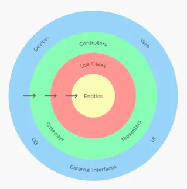

# Java Template Service

> A template with pre-defined resources for developing a Java service.

This template was developed using clean architecture and its organization is defined as:



```
- config
  - bean
  - database
- core
  - domain
  - usecase
- entrypoint
  - rest
- gateway
  - database
  - domain
```

## Endpoints

| path                       | method | description             |
|----------------------------|--------|-------------------------|
| /devtools/v1/template      | POST   | Create new template     | 
| /devtools/v1/template      | GET    | Read all templates      | 
| /devtools/v1/template/{id} | GET    | Read one template by id | 
| /devtools/v1/template/{id} | PUT    | Update template         | 
| /devtools/v1/template/{id} | DELETE | Delete template         |